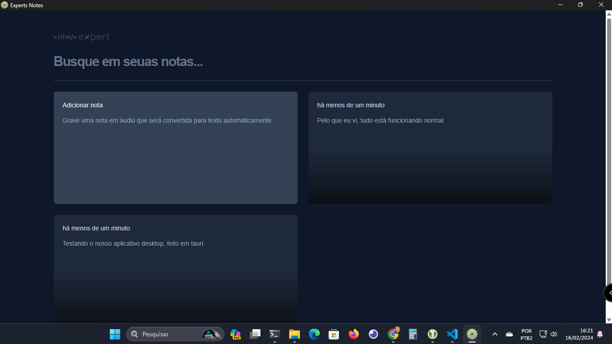
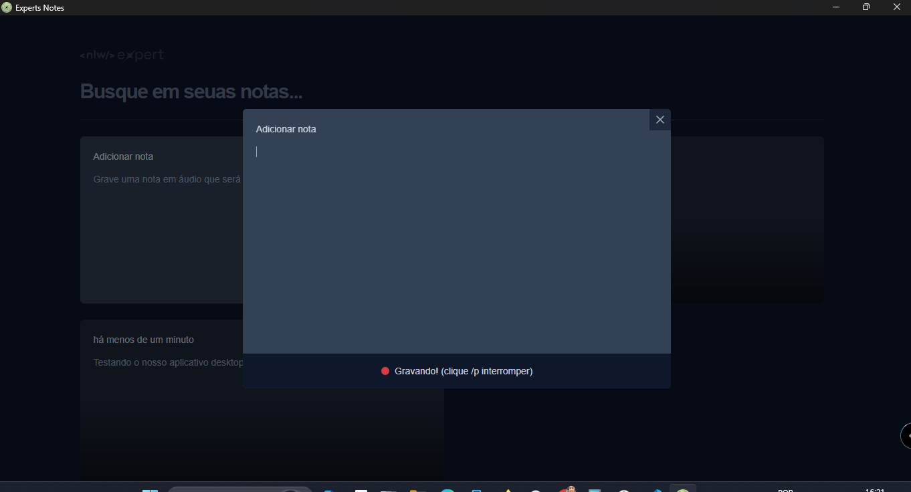
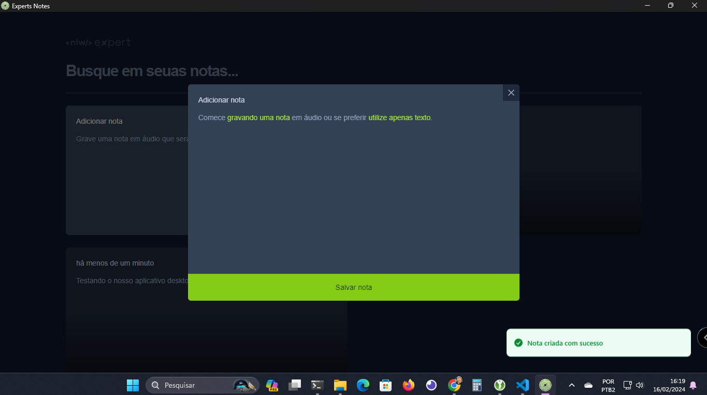

<p align="center"> 
  <h1 align="center">Project carried out after NLW 2024 based on the web project for note-taking. Made upon Diego Fernandes suggestion. Developed using Tauri. <span>💜 at Rockeseat.</span></h1>
  
   
   

  

  <p align="center"  style="margin-top: 20px;">
    🔗 <a href="https://github.com/Andreoew/notes/releases">Download to test.</a> 🔗
  </p>  

  <!-- Write here what the project is about. -->
  <h1 align="center">About</h1>
  This project is a desktop application designed for audio-to-text transcription. Leveraging the browser's API, the application captures user audio and efficiently converts it into text. Built with Tauri, a tool for developing cross-platform desktop applications using web technologies, this project provides an integrated and responsive user experience. Simplify your audio transcription tasks with this easy-to-use and effective application.

Key features:
- User audio capture
- Real-time audio-to-text conversion
- Intuitive and user-friendly interface
- Works across multiple platforms: Windows, macOS, and Linux

Try it now and enhance your productivity with automated audio transcription!

<!-- ### Regras da aplicação -->


🚧 Finished Project 🚧

 []


🚧 Under Construction 🚧

[✅]
</p>

<!-- ## 🧭 Table of contents

- [🧭 Table of contents](#-table-of-contents)
- [🎥 Implementation Video](#-implementation-video)
- [🎨 Layout](#-layout)
- [👏 Learning and more Implementations](#-learning-and-more-implementations)
- [💡 Technologies Used](#-technologies-used)
- [📂 Folder Structure](#-folder-structure)
- [🚀 Running the Project](#-running-the-project)
  - [Back-end](#back-end)
  - [Front-end Web](#front-end-web)
  - [Mobile](#mobile)
- [📝 Routes](#-routes)
- [🌎 License](#-license)
- [✒ Author](#-author)

## 🎥 Implementation Video

In the GitHub edit, drag the video that it already puts on github itself.

## 🎨 Layout

Layout developed by [Name](https://www.instagram.com/urlName/)

[](https://www.figma.com/files)

## 👏 Learning and more Implementations

Describe what you learned and implemented in the project. -->

## 💡 Technologies Used

### Tauri
### React
### radix-ui
### date-fns
### lucide-react
### sonner

- [x] [Tauri](https://tauri.app/)
- [x] [React](https://pt-br.legacy.reactjs.org/)
- [x] [radix-ui](https://github.com/radix-ui)
- [x] [date-fns](https://date-fns.org/)
- [x] [lucide-react](https://github.com/lucide-icons/lucide)
- [x] [sonner](https://github.com/d3alek/sonner)
<!--

## 📂 Folder Structure

```plainText
app
.
├── __tests__
├── android                     # Native android files
├── ios                         # Native ios files
├── src                         # Source files
│   ├── @types                  # Contains all global definitions of types and interfaces
│   ├── assets                  # Contains Js bundles assets. e.g: icons, splash, images etc...
│   ├── components              # Contains all global react components
│   ├── context                 # All contexts
│   ├── constants               # Constants files
│   ├── hooks                   # Cstomized hooks
│   ├── navigation
│   ├── screens
│   ├── services                # Contains external and api services
│   ├── App                     # Aplication entry
.
.
├── index                       # Bundle entry
.
.
└── README.md
```

## 🚀 Running the Project

### Back-end

Clone the project

```bash
  git clone https://link-para-o-projeto
```

Enter the project directory

```bash
  cd my-project
```

Install with dependencies

```bash
  npm install
```

Start the server

```bash
  npm run start
```

### Front-end Web

Clone the project

```bash
  git clone https://link-para-o-projeto
```

Enter the project directory

```bash
  cd my-project
```

Install with dependencies

```bash
  npm install
```

Start the server

```bash
  npm run start
```

### Mobile

Clone the project

```bash
  git clone https://link-para-o-projeto
```

Enter the project directory

```bash
  cd my-project
```

Install with dependencies

```bash
  npm install
```

Start the server

```bash
  npx expo start
```

- IOS:

```bash
  npx pod-install && npx react-native run-ios
```

- Android:

```bash
  npx react-native run-android
```

## 📝 Routes

[](https://app.getpostman.com/run-collection/link)
[](https://insomnia.rest/run/?label=NAMEPROJECT&uri=LINK)

## 🌎 License

This project is under the MIT license. See the [LICENSE](https://choosealicense.com/licenses/mit/) file for more details. -->

## ✒ Author

<p align="center">
  

  <h3 align="center">André de Souza</h3>
  
  <p align="center">  
    Done with love and faith not to give up 😅, get in touch!
  </p>
</p>  
  
<div align="center">

[](https://www.linkedin.com/in/andredessilva/)
[](mailto:seutecdev@gmail.com)
[](https://github.com/andreoew)

</div>